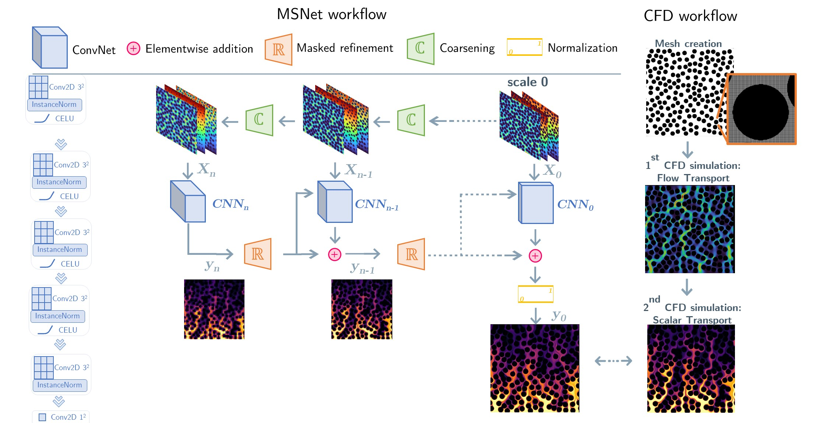

# Prediction of local concentration fields in porous media with chemical reaction using a multi scale convolutional neural network

Fork of Javier Santos' [MS-Net](https://github.com/je-santos/ms_net), modified for use in the prediction of scalar fields in porous reactive systems.

<p align="center">
</img>
</p>

In this repository we share the Pytorch code of MSNet employed for our article published in the [Chemical Engineering Journal](https://www.sciencedirect.com/science/article/pii/S1385894722058478). The network has been trained to predict the concentration fields of a reactive species in 2D porous media. The trained network can generalize on new geometries and operating conditions (Reynolds and Péclet numbers).

## Workflow
The following illustration shows how the information flows through the individual networks (left).
MSNet has been trained on a dataset of CFD simulations of reactive transport (right).

<p align="center">
</img>
</p>

In this work both geometrical features (euclidean distance transform and time of flight) and operating conditions (pressure/diffusion coefficient) are employed as input to the network. 

## Dataset availablity

Data available here

## Usage

```python
import torch

from network import MS_Net
from pore_utils import load_samples, concat_features
from network_tools import get_masks


net = MS_Net( 
              num_scales    := 6,  # num of trainable convNets
              num_features  = 3,   # input features (Euclidean distance, time of flight, operating conditions)
              num_filters   = 2,   # num of kernels on each layer of the finest model (most expensive)
              summary       = True # print the model summary
)

file_name = 'sample_x'
operating_conditions = 00

x_edist = load_samples( feat='edist', sample_name = file_name, scales = num_scales)
x_tof   = load_samples( feat='tof', sample_name = file_name, scales = num_scales)
x_p_D   = load_samples( feat='p/D', sample_name = file_name, scales = num_scales, p_D = operating_conditions)

x = concat_features(feats = [x_edist, x_tof, x_p_D])
masks = get_masks( x_edist[-1],    scales = num_scales )
y     = net( x, masks )[-1] # final prediction
```


## Citation
If you use our code for your own research, we would be grateful if you cite our publications:

[CEJ](https://www.sciencedirect.com/science/article/pii/S1385894722058478)
```
@article{reactive-msnet,
  title={Prediction of local concentration fields in porous media with chemical reaction using a multi scale convolutional neural network},
  author={Marcato, Agnese and Santos, Javier E and Boccardo, Gianluca and Viswanathan, Hari and Marchisio, Daniele and Prodanovi{\'c}, Ma{\v{s}}a},
  journal={Chemical Engineering Journal},
  pages={140367},
  year={2022},
  publisher={Elsevier}
}
```
[TiPM](https://link.springer.com/article/10.1007/s11242-021-01617-y)
```
@article{msnet,
  title={Computationally efficient multiscale neural networks applied to fluid flow in complex 3D porous media},
  author={Santos, Javier E and Yin, Ying and Jo, Honggeun and Pan, Wen and Kang, Qinjun and Viswanathan, Hari S and Prodanovi{\'c}, Ma{\v{s}}a and Pyrcz, Michael J and Lubbers, Nicholas},
  journal={Transport in porous media},
  volume={140},
  number={1},
  pages={241--272},
  year={2021},
  publisher={Springer}
}
```

