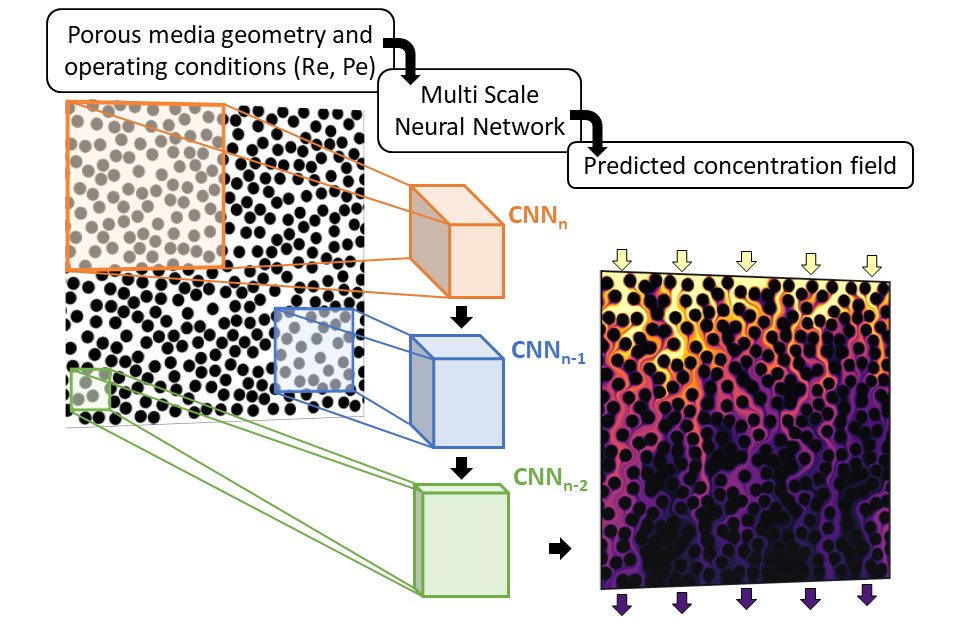

# Prediction of local concentration fields in porous media with chemical reaction using a multi scale convolutional neural network

Fork of Javier Santos' [MS-Net](https://github.com/je-santos/ms_net), modified for use in the prediction of scalar fields in porous reactive systems.

<p align="center">
</img>
</p>

In this repository we share the code of MSNet employed in our work published on the [Chemical Engineering Journal](https://www.sciencedirect.com/science/article/pii/S1385894722058478). The network has been trained to predict the concentration fields of a reactive species in 2D porous media. The trained network can generalize on new geometries and operating conditions (Reynolds and Péclet numbers).

## Workflow
The following illustration shows how the information flows through the individual networks (left).
MSNet has been trained on a dataset of CFD simulations (right).

<p align="center">
</img>
</p>

In this work both geometrical features (euclidean distance transform and time of flight) and operating conditions (pressure/diffusion coefficient) are employed as input to the network. 

## Dataset availablity

Data available here

## Usage

```python
import torch

from network import MS_Net
from pore_utils import rnd_array
from network_tools import get_masks

net = MS_Net( 
              num_scales   := 4,   # num of trainable convNets
              num_features  = 1,   # input features (Euclidean distance, etc)
              num_filters   = 2,   # num of kernels on each layer of the finest model (most expensive)
              summary       = True # print the model summary
)

x     = rnd_array( size=128, scales = num_scales )
masks = get_masks( x[-1],    scales = num_scales )
y     = net( x, masks )[-1] # final prediction
```


## Citation
If you use our code for your own research, we would be grateful if you cite our publications:

[CEJ](https://www.sciencedirect.com/science/article/pii/S1385894722058478)
```
@article{reactiveMSNET,
title = "Prediction of local concentration fields in porous media with chemical reaction using a multi scale convolutional neural network",
journal = "Chem Eng J",
year = "2022",
issn = "140367",
doi = "https://doi.org/10.1016/j.cej.2022.140367",
url = "https://www.sciencedirect.com/science/article/pii/S1385894722058478"
}
```
[TiPM](https://link.springer.com/article/10.1007/s11242-021-01617-y)
```
@article{MSNET,
title = "Computationally Efficient Multiscale Neural Networks Applied to Fluid Flow in Complex 3D Porous Media",
journal = " Transp Porous Med",
year = "2021",
issn = "1573-1634",
doi = "https://doi.org/10.1007/s11242-021-01617-y",
url = "https://link.springer.com/article/10.1007/s11242-021-01617-y"
}
```

